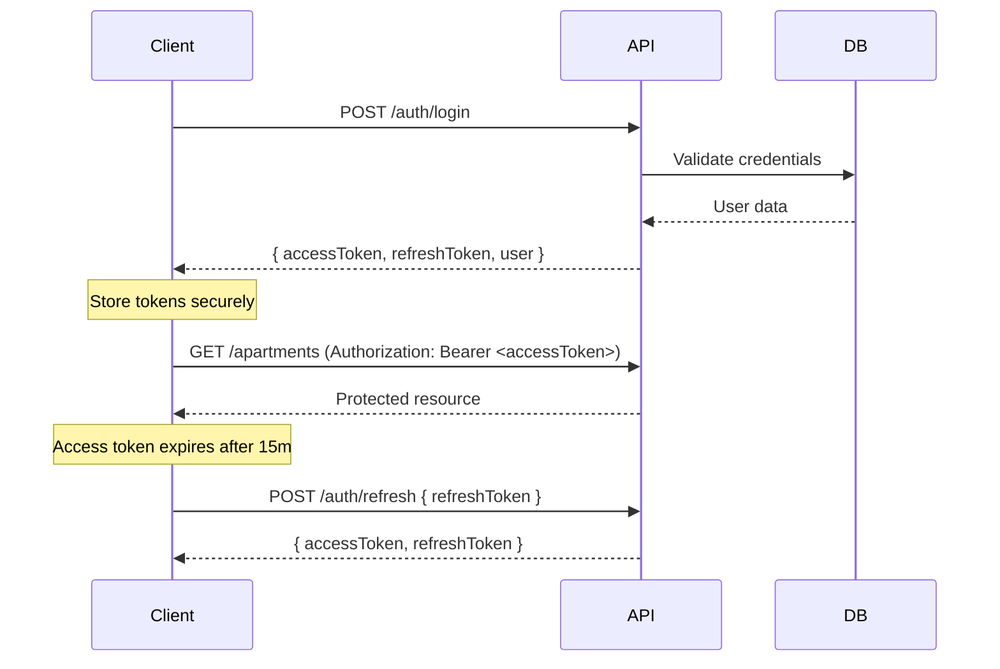

# API Guide - Vully Platform

Complete API reference for the Vully apartment management platform.

## 📍 Base URLs

| Environment | API Base URL | Swagger Docs |
|-------------|--------------|--------------|
| Development | `http://localhost:3001` | `http://localhost:3001/api/docs` |
| Staging     | `https://api-staging.vully.com` | `https://api-staging.vully.com/api/docs` |
| Production  | `https://api.vully.com` | `https://api.vully.com/api/docs` |

## 🔐 Authentication

### Overview
Vully uses JWT (JSON Web Tokens) with access and refresh token rotation.

**Token Lifetimes:**
- Access Token: 15 minutes
- Refresh Token: 7 days (rotated on use)

### Authentication Flow



### Endpoints

#### POST `/api/auth/login`
**Description:** Authenticate user and receive JWT tokens

**Request Body:**
```json
{
  "email": "admin@vully.com",
  "password": "Admin@123"
}
```

**Response:** `200 OK`
```json
{
  "data": {
    "user": {
      "id": "uuid-v4",
      "email": "admin@vully.com",
      "firstName": "Admin",
      "lastName": "User",
      "role": "admin",
      "isActive": true
    },
    "accessToken": "eyJhbGciOiJIUzI1NiIsInR5cCI6IkpXVCJ9...",
    "refreshToken": "eyJhbGciOiJIUzI1NiIsInR5cCI6IkpXVCJ9..."
  }
}
```

**Error Responses:**
- `401 Unauthorized` - Invalid credentials
- `403 Forbidden` - Account inactive

---

#### POST `/api/auth/refresh`
**Description:** Refresh access token using refresh token

**Request Body:**
```json
{
  "refreshToken": "eyJhbGciOiJIUzI1NiIsInR5cCI6IkpXVCJ9..."
}
```

**Response:** `200 OK`
```json
{
  "data": {
    "accessToken": "eyJhbGciOiJIUzI1NiIsInR5cCI6IkpXVCJ9...",
    "refreshToken": "eyJhbGciOiJIUzI1NiIsInR5cCI6IkpXVCJ9..."
  }
}
```

**Notes:**
- Old refresh token is invalidated
- New refresh token must be stored

---

#### POST `/api/auth/logout`
**Description:** Invalidate refresh token

**Headers:**
```
Authorization: Bearer <accessToken>
```

**Request Body:**
```json
{
  "refreshToken": "eyJhbGciOiJIUzI1NiIsInR5cCI6IkpXVCJ9..."
}
```

**Response:** `200 OK`
```json
{
  "message": "Logged out successfully"
}
```

---

#### GET `/api/auth/me`
**Description:** Get current user profile

**Headers:**
```
Authorization: Bearer <accessToken>
```

**Response:** `200 OK`
```json
{
  "data": {
    "id": "uuid-v4",
    "email": "admin@vully.com",
    "firstName": "Admin",
    "lastName": "User",
    "role": "admin",
    "phone": "+84901234567",
    "isActive": true,
    "createdAt": "2026-01-15T10:30:00Z",
    "updatedAt": "2026-03-01T14:20:00Z"
  }
}
```

---

## 🏢 Apartments Module

### Buildings

#### GET `/api/apartments/buildings`
**Description:** List all buildings with pagination

**Query Parameters:**
| Parameter | Type | Required | Default | Description |
|-----------|------|----------|---------|-------------|
| `page` | number | No | 1 | Page number |
| `limit` | number | No | 20 | Items per page |
| `search` | string | No | - | Search by name or address |

**Response:** `200 OK`
```json
{
  "data": [
    {
      "id": "uuid-v4",
      "name": "Building A",
      "address": "123 Main St, District 1, HCMC",
      "totalFloors": 10,
      "totalUnits": 80,
      "occupiedUnits": 65,
      "occupancyRate": 0.8125,
      "createdAt": "2026-01-01T00:00:00Z"
    }
  ],
  "meta": {
    "total": 5,
    "page": 1,
    "limit": 20,
    "totalPages": 1
  }
}
```

**RBAC:** All authenticated users

---

#### POST `/api/apartments/buildings`
**Description:** Create a new building

**Headers:**
```
Authorization: Bearer <accessToken>
Content-Type: application/json
```

**Request Body:**
```json
{
  "name": "Building B",
  "address": "456 Second St, District 2, HCMC",
  "totalFloors": 15,
  "description": "Modern residential building with 120 units",
  "amenities": ["pool", "gym", "parking"],
  "contactPhone": "+84901234567",
  "contactEmail": "buildingb@vully.com"
}
```

**Response:** `201 Created`
```json
{
  "data": {
    "id": "uuid-v4",
    "name": "Building B",
    "address": "456 Second St, District 2, HCMC",
    "totalFloors": 15,
    "totalUnits": 0,
    "occupiedUnits": 0,
    "occupancyRate": 0,
    "description": "Modern residential building with 120 units",
    "amenities": ["pool", "gym", "parking"],
    "contactPhone": "+84901234567",
    "contactEmail": "buildingb@vully.com",
    "createdAt": "2026-04-01T10:00:00Z",
    "updatedAt": "2026-04-01T10:00:00Z"
  }
}
```

**RBAC:** Admin only

---

### Apartments

#### GET `/api/apartments`
**Description:** List apartments with filters

**Query Parameters:**
| Parameter | Type | Required | Default | Description |
|-----------|------|----------|---------|-------------|
| `buildingId` | uuid | No | - | Filter by building |
| `floorNumber` | number | No | - | Filter by floor |
| `status` | enum | No | - | `vacant`, `occupied`, `maintenance` |
| `page` | number | No | 1 | Page number |
| `limit` | number | No | 20 | Items per page |

**Response:** `200 OK`
```json
{
  "data": [
    {
      "id": "uuid-v4",
      "unitNumber": "A101",
      "floorNumber": 1,
      "bedrooms": 2,
      "bathrooms": 2,
      "area": 75.5,
      "status": "occupied",
      "building": {
        "id": "uuid-v4",
        "name": "Building A"
      },
      "currentContract": {
        "id": "uuid-v4",
        "tenant": {
          "firstName": "John",
          "lastName": "Doe"
        },
        "rentAmount": 5000000,
        "startDate": "2026-01-01",
        "endDate": "2026-12-31"
      }
    }
  ],
  "meta": {
    "total": 80,
    "page": 1,
    "limit": 20,
    "totalPages": 4
  }
}
```

**RBAC:** 
- Admin: All apartments
- Resident: Only assigned apartment

---

#### POST `/api/apartments`
**Description:** Create a new apartment unit

**Request Body:**
```json
{
  "buildingId": "uuid-v4",
  "unitNumber": "B205",
  "floorNumber": 2,
  "bedrooms": 3,
  "bathrooms": 2,
  "area": 95.0,
  "baseRent": 7000000,
  "description": "Spacious 3-bedroom unit with city view"
}
```

**Response:** `201 Created`

**RBAC:** Admin only

---

### Contracts

#### POST `/api/apartments/:apartmentId/contracts`
**Description:** Create rental contract for apartment

**Request Body:**
```json
{
  "tenantId": "uuid-v4",
  "startDate": "2026-05-01",
  "endDate": "2027-04-30",
  "rentAmount": 5000000,
  "depositAmount": 10000000,
  "terms": "Standard 12-month lease with 2-month deposit"
}
```

**Response:** `201 Created`
```json
{
  "data": {
    "id": "uuid-v4",
    "apartmentId": "uuid-v4",
    "tenantId": "uuid-v4",
    "status": "active",
    "startDate": "2026-05-01",
    "endDate": "2027-04-30",
    "rentAmount": 5000000,
    "depositAmount": 10000000,
    "depositPaidAt": null,
    "terms": "Standard 12-month lease with 2-month deposit",
    "createdAt": "2026-04-01T10:00:00Z"
  }
}
```

**RBAC:** Admin only

---

#### PATCH `/api/apartments/contracts/:id/terminate`
**Description:** Terminate a contract early

**Request Body:**
```json
{
  "terminationDate": "2026-06-30",
  "reason": "Tenant relocation"
}
```

**Response:** `200 OK`

**RBAC:** Admin only

---

## 💰 Billing Module

### Meter Readings

#### POST `/api/billing/meter-readings`
**Description:** Submit utility meter reading

**Request Body:**
```json
{
  "apartmentId": "uuid-v4",
  "type": "electric",
  "value": 1250.5,
  "readingDate": "2026-03-31T23:59:59Z",
  "notes": "End of month reading"
}
```

**Field Descriptions:**
- `type`: `"electric"` | `"water"` | `"gas"`
- `value`: Meter reading in kWh (electric), m³ (water/gas)

**Response:** `201 Created`
```json
{
  "data": {
    "id": "uuid-v4",
    "apartmentId": "uuid-v4",
    "type": "electric",
    "value": 1250.5,
    "previousValue": 1150.0,
    "usage": 100.5,
    "readingDate": "2026-03-31T23:59:59Z",
    "submittedBy": "uuid-v4",
    "createdAt": "2026-04-01T09:00:00Z"
  }
}
```

**RBAC:** Admin, Technician

---

#### GET `/api/billing/meter-readings`
**Description:** Get meter reading history

**Query Parameters:**
| Parameter | Type | Required | Default | Description |
|-----------|------|----------|---------|-------------|
| `apartmentId` | uuid | Yes | - | Apartment to query |
| `type` | enum | No | - | `electric`, `water`, `gas` |
| `startDate` | date | No | - | Filter from date |
| `endDate` | date | No | - | Filter to date |

**Response:** `200 OK`
```json
{
  "data": [
    {
      "id": "uuid-v4",
      "type": "electric",
      "value": 1250.5,
      "usage": 100.5,
      "readingDate": "2026-03-31T23:59:59Z",
      "cost": 500000
    }
  ]
}
```

---

### Invoices

#### GET `/api/billing/invoices`
**Description:** List invoices with filters

**Query Parameters:**
| Parameter | Type | Required | Default | Description |
|-----------|------|----------|---------|-------------|
| `apartmentId` | uuid | No | - | Filter by apartment |
| `status` | enum | No | - | `pending`, `paid`, `overdue`, `cancelled` |
| `billingPeriod` | string | No | - | Format: `YYYY-MM` |
| `page` | number | No | 1 | Page number |
| `limit` | number | No | 20 | Items per page |

**Response:** `200 OK`
```json
{
  "data": [
    {
      "id": "uuid-v4",
      "invoiceNumber": "INV-202603-0001",
      "billingPeriod": "2026-03",
      "status": "pending",
      "issueDate": "2026-03-01",
      "dueDate": "2026-03-15",
      "subtotal": 5500000,
      "taxAmount": 0,
      "totalAmount": 5500000,
      "paidAmount": 0,
      "apartment": {
        "unitNumber": "A101",
        "building": { "name": "Building A" }
      },
      "tenant": {
        "firstName": "John",
        "lastName": "Doe"
      },
      "lineItems": [
        {
          "description": "Rent for 2026-03",
          "quantity": 1,
          "unitPrice": 5000000,
          "amount": 5000000
        },
        {
          "description": "Electric - 100.5 kWh",
          "quantity": 100.5,
          "unitPrice": 4975,
          "amount": 500000
        }
      ]
    }
  ],
  "meta": {
    "total": 150,
    "page": 1,
    "limit": 20,
    "totalPages": 8
  }
}
```

**RBAC:**
- Admin: All invoices
- Resident: Own invoices only

---

#### GET `/api/billing/invoices/:id`
**Description:** Get invoice details

**Response:** `200 OK` (same structure as list item)

---

#### POST `/api/billing/invoices/generate`
**Description:** Generate monthly invoices for all active contracts (Background job)

**Request Body:**
```json
{
  "billingPeriod": "2026-04",
  "dueDate": "2026-04-15",
  "notes": "April 2026 billing cycle"
}
```

**Response:** `202 Accepted`
```json
{
  "data": {
    "jobId": "job-uuid",
    "status": "queued",
    "estimatedTime": "5-10 minutes",
    "message": "Invoice generation job queued. Check /billing/invoices/generate/:jobId for progress."
  }
}
```

**RBAC:** Admin only

**Notes:**
- Runs as BullMQ background job
- Processes all active contracts
- Sends notifications to residents
- Can take 5-10 minutes for large datasets

---

#### GET `/api/billing/invoices/generate/:jobId`
**Description:** Check invoice generation job status

**Response:** `200 OK`
```json
{
  "data": {
    "jobId": "job-uuid",
    "status": "completed",
    "progress": 100,
    "result": {
      "totalInvoices": 78,
      "successCount": 78,
      "failureCount": 0,
      "errors": []
    },
    "completedAt": "2026-04-01T10:15:00Z"
  }
}
```

**Statuses:** `queued`, `active`, `completed`, `failed`

---

#### PATCH `/api/billing/invoices/:id/pay`
**Description:** Mark invoice as paid

**Request Body:**
```json
{
  "paidAmount": 5500000,
  "paymentMethod": "bank_transfer",
  "paymentReference": "TXN-20260315-001",
  "paidAt": "2026-03-15T14:30:00Z"
}
```

**Response:** `200 OK`

**RBAC:** Admin only

---

## 🔧 Incidents Module

### Incidents

#### POST `/api/incidents`
**Description:** Create new incident report

**Request Body:**
```json
{
  "apartmentId": "uuid-v4",
  "category": "plumbing",
  "priority": "high",
  "title": "Leaking kitchen faucet",
  "description": "The kitchen faucet has been dripping continuously for 2 days. Water pressure seems normal.",
  "images": ["https://s3.amazonaws.com/vully/incident-1.jpg"]
}
```

**Field Descriptions:**
- `category`: `"plumbing"` | `"electrical"` | `"hvac"` | `"appliance"` | `"structural"` | `"other"`
- `priority`: `"low"` | `"medium"` | `"high"` | `"urgent"`

**Response:** `201 Created`
```json
{
  "data": {
    "id": "uuid-v4",
    "incidentNumber": "INC-20260401-001",
    "apartmentId": "uuid-v4",
    "category": "plumbing",
    "priority": "high",
    "status": "pending",
    "title": "Leaking kitchen faucet",
    "description": "...",
    "images": ["https://s3.amazonaws.com/vully/incident-1.jpg"],
    "reportedBy": "uuid-v4",
    "assignedTo": null,
    "createdAt": "2026-04-01T10:00:00Z"
  }
}
```

**RBAC:** All authenticated users (scoped to own apartment for residents)

---

#### GET `/api/incidents`
**Description:** List incidents with filters

**Query Parameters:**
| Parameter | Type | Required | Default | Description |
|-----------|------|----------|---------|-------------|
| `apartmentId` | uuid | No | - | Filter by apartment |
| `buildingId` | uuid | No | - | Filter by building |
| `status` | enum | No | - | `pending`, `assigned`, `in_progress`, `resolved`, `closed` |
| `category` | enum | No | - | See categories above |
| `priority` | enum | No | - | `low`, `medium`, `high`, `urgent` |
| `assignedTo` | uuid | No | - | Filter by technician |

**Response:** `200 OK`
```json
{
  "data": [
    {
      "id": "uuid-v4",
      "incidentNumber": "INC-20260401-001",
      "title": "Leaking kitchen faucet",
      "category": "plumbing",
      "priority": "high",
      "status": "assigned",
      "apartment": {
        "unitNumber": "A101",
        "building": { "name": "Building A" }
      },
      "reportedBy": {
        "firstName": "John",
        "lastName": "Doe"
      },
      "assignedTo": {
        "firstName": "Mike",
        "lastName": "Technician"
      },
      "createdAt": "2026-04-01T10:00:00Z",
      "updatedAt": "2026-04-01T11:30:00Z"
    }
  ],
  "meta": {
    "total": 45,
    "page": 1,
    "limit": 20,
    "totalPages": 3
  }
}
```

**RBAC:**
- Admin/Technician: All incidents
- Resident: Own apartment incidents

---

#### PATCH `/api/incidents/:id/assign`
**Description:** Assign incident to technician

**Request Body:**
```json
{
  "assignedTo": "technician-uuid"
}
```

**Response:** `200 OK`

**WebSocket Event:** `incident:assigned` broadcast to technician and admin rooms

**RBAC:** Admin only

---

#### PATCH `/api/incidents/:id/status`
**Description:** Update incident status

**Request Body:**
```json
{
  "status": "in_progress",
  "notes": "Started repair work. Will replace faucet cartridge."
}
```

**Allowed Transitions:**
- `pending` → `assigned`
- `assigned` → `in_progress`
- `in_progress` → `resolved`
- `resolved` → `closed`

**Response:** `200 OK`

**WebSocket Event:** `incident:updated` broadcast to relevant rooms

**RBAC:**
- Admin: All transitions
- Technician: Only assigned incidents

---

## 🤖 AI Assistant Module

### Chat

#### POST `/api/ai-assistant/chat`
**Description:** Send message to AI assistant (RAG-powered)

**Request Body:**
```json
{
  "query": "What are the building rules for keeping pets?",
  "apartmentId": "uuid-v4",
  "buildingId": "uuid-v4"
}
```

**Response:** `200 OK`
```json
{
  "data": {
    "response": "According to the building regulations, residents are allowed to keep small pets (cats, dogs under 10kg) with the following conditions:\n\n1. Maximum 2 pets per apartment\n2. Pets must be registered with building management\n3. Monthly pet fee: 200,000 VND per pet\n4. Pets must not disturb other residents\n\nFor more details, please refer to Section 5.3 of the Building Rules.",
    "sources": [
      {
        "title": "Building Rules & Regulations",
        "category": "building-rules",
        "relevance": 0.94
      },
      {
        "title": "Pet Policy FAQ",
        "category": "faq",
        "relevance": 0.87
      }
    ],
    "responseTime": 1234
  }
}
```

**Rate Limiting:**
- Admin: Unlimited
- Technician/Resident: 20 queries/day

**Response Time:** Typically 1-3 seconds

**RBAC:** All authenticated users

---

#### GET `/api/ai-assistant/quota`
**Description:** Get remaining AI query quota for today

**Response:** `200 OK`
```json
{
  "data": {
    "used": 5,
    "limit": 20,
    "remaining": 15,
    "resetsAt": "2026-04-02T00:00:00Z"
  }
}
```

**Notes:**
- Admins always get `{ remaining: "unlimited" }`
- Quota resets daily at midnight UTC

---

#### GET `/api/ai-assistant/history`
**Description:** Get chat history for current user

**Query Parameters:**
| Parameter | Type | Required | Default | Description |
|-----------|------|----------|---------|-------------|
| `limit` | number | No | 10 | Number of messages |

**Response:** `200 OK`
```json
{
  "data": [
    {
      "id": "uuid-v4",
      "query": "What are the building rules for keeping pets?",
      "response": "According to the building regulations...",
      "sourceDocs": ["doc-uuid-1", "doc-uuid-2"],
      "tokensUsed": 250,
      "responseTime": 1234,
      "createdAt": "2026-04-01T10:00:00Z"
    }
  ]
}
```

---

## 📊 Statistics Module

### Dashboard Stats

#### GET `/api/stats/dashboard`
**Description:** Get dashboard overview statistics

**Query Parameters:**
| Parameter | Type | Required | Default | Description |
|-----------|------|----------|---------|-------------|
| `buildingId` | uuid | No | - | Filter by building |

**Response:** `200 OK`
```json
{
  "data": {
    "occupancy": {
      "totalUnits": 200,
      "occupiedUnits": 165,
      "vacantUnits": 30,
      "maintenanceUnits": 5,
      "rate": 0.825
    },
    "revenue": {
      "thisMonth": 825000000,
      "lastMonth": 800000000,
      "change": 3.125,
      "pendingAmount": 150000000
    },
    "incidents": {
      "pending": 12,
      "inProgress": 8,
      "resolvedThisMonth": 45,
      "avgResolutionTime": 18.5
    },
    "contracts": {
      "active": 165,
      "expiringSoon": 12,
      "expiringThisMonth": 5
    }
  }
}
```

**Cache:** 5 minutes (Redis)

**RBAC:** Admin only

---

## 🏥 Health & Monitoring

#### GET `/health`
**Description:** Liveness probe

**Response:** `200 OK`
```json
{
  "status": "ok",
  "timestamp": "2026-04-01T10:00:00Z"
}
```

---

#### GET `/health/ready`
**Description:** Readiness probe (checks dependencies)

**Response:** `200 OK`
```json
{
  "status": "ok",
  "info": {
    "database": {
      "status": "up",
      "latency": 5
    },
    "redis": {
      "status": "up",
      "latency": 2
    },
    "queue": {
      "status": "up",
      "waiting": 0,
      "active": 1
    }
  },
  "error": {},
  "details": {
    "database": {
      "status": "up",
      "latency": 5
    },
    "redis": {
      "status": "up",
      "latency": 2
    },
    "queue": {
      "status": "up",
      "waiting": 0,
      "active": 1
    }
  }
}
```

**Error Response:** `503 Service Unavailable` if any dependency is down

---

## 📦 Response Format

### Success Response
```json
{
  "data": { /* response data */ },
  "meta": { /* pagination metadata */ }
}
```

### Error Response
```json
{
  "statusCode": 400,
  "message": "Validation failed",
  "errors": [
    {
      "field": "email",
      "message": "Invalid email format"
    }
  ],
  "timestamp": "2026-04-01T10:00:00Z",
  "path": "/api/auth/login"
}
```

### HTTP Status Codes

| Code | Meaning | When Used |
|------|---------|-----------|
| 200 | OK | Successful GET/PATCH/DELETE |
| 201 | Created | Successful POST |
| 202 | Accepted | Async job queued |
| 400 | Bad Request | Validation error |
| 401 | Unauthorized | Missing/invalid token |
| 403 | Forbidden | Insufficient permissions |
| 404 | Not Found | Resource doesn't exist |
| 409 | Conflict | Duplicate resource |
| 422 | Unprocessable Entity | Business logic error |
| 429 | Too Many Requests | Rate limit exceeded |
| 500 | Internal Server Error | Server error |
| 503 | Service Unavailable | Dependency down |

---

## 🧪 Testing with curl

### Login
```bash
curl -X POST http://localhost:3001/api/auth/login \
  -H "Content-Type: application/json" \
  -d '{"email":"admin@vully.com","password":"Admin@123"}'
```

### Authenticated Request
```bash
TOKEN="your-access-token"
curl -X GET http://localhost:3001/api/apartments \
  -H "Authorization: Bearer $TOKEN"
```

### Create Incident
```bash
curl -X POST http://localhost:3001/api/incidents \
  -H "Authorization: Bearer $TOKEN" \
  -H "Content-Type: application/json" \
  -d '{
    "apartmentId": "uuid-here",
    "category": "plumbing",
    "priority": "high",
    "title": "Leaking faucet",
    "description": "Kitchen tap dripping"
  }'
```

---

## 🔌 WebSocket Events

### Connection
```javascript
import io from 'socket.io-client';

const socket = io('http://localhost:3001', {
  auth: {
    token: 'your-access-token'
  }
});

socket.on('connect', () => {
  console.log('Connected!');
});
```

### Join Rooms
```javascript
// Join apartment room
socket.emit('join-room', 'apartment:uuid-v4');

// Join building room
socket.emit('join-room', 'building:uuid-v4');
```

### Listen to Events
```javascript
// Incident events
socket.on('incident:created', (data) => {
  console.log('New incident:', data);
});

socket.on('incident:updated', (data) => {
  console.log('Incident updated:', data);
});

socket.on('incident:assigned', (data) => {
  console.log('Incident assigned:', data);
});

// Invoice events
socket.on('invoice:created', (data) => {
  console.log('New invoice:', data);
});
```

---

## 📚 Related Documentation

- [README.md](./README.md) - Setup guide
- [ENVIRONMENT.md](./ENVIRONMENT.md) - Environment variables
- [ARCHITECTURE.md](./ARCHITECTURE.md) - System design

---

**Last Updated:** Phase 7.2 - April 2026  
**API Version:** 1.0.0  
**Maintainer:** Vully Development Team
