# Design: Scaffold Apartment Management Platform

## Architecture Overview

```
┌─────────────────────────────────────────────────────────────────────────────┐
│                              FRONTEND (Next.js 15)                          │
├─────────────┬─────────────┬─────────────┬─────────────┬────────────────────┤
│  Dashboard  │   SVG Map   │   Billing   │  Incidents  │   AI Chat Widget   │
│   Widgets   │   Engine    │     UI      │     UI      │                    │
├─────────────┴─────────────┴─────────────┴─────────────┴────────────────────┤
│  Shadcn/UI (Components) + Framer Motion (Animations) + Shepherd.js (Tours) │
├─────────────────────────────────────────────────────────────────────────────┤
│    TanStack Query (Server) + Zustand (Global) + Nuqs (URL) + RHF + Zod     │
├─────────────────────────────────────────────────────────────────────────────┤
│                         WebSocket Client (Socket.IO)                        │
└───────────────────────────────────┬─────────────────────────────────────────┘
                                    │ HTTP/WS
┌───────────────────────────────────┴─────────────────────────────────────────┐
│                              BACKEND (NestJS)                                │
├─────────────────────────────────────────────────────────────────────────────┤
│                         API Gateway (REST + WebSocket)                       │
│                    ┌──────────────┬──────────────────────┐                  │
│                    │  Auth Guard  │  Interceptors (Pino) │                  │
│                    │   (RBAC)     │  @nestjs/terminus    │                  │
│                    └──────────────┴──────────────────────┘                  │
├─────────────┬─────────────┬─────────────┬─────────────┬────────────────────┤
│  Identity   │   Billing   │  Apartments │  Incidents  │   AI Engine        │
│   Module    │   Module    │   Module    │  + ClamAV   │   Wrapper          │
├─────────────┴──────┬──────┴─────────────┴──────┬──────┴────────────────────┤
│                    │                           │                            │
│            ┌───────▼───────┐           ┌───────▼───────┐                   │
│            │   BullMQ      │           │   WebSocket   │                   │
│            │   Workers     │           │   Gateway     │                   │
│            └───────┬───────┘           └───────────────┘                   │
│                    │                                                        │
├────────────────────┼────────────────────────────────────────────────────────┤
│              PERSISTENCE LAYER                                              │
│     ┌──────────────┼──────────────┬─────────────────────────┐              │
│     │              │              │                          │              │
│     ▼              ▼              ▼                          ▼              │
│ PostgreSQL      Redis        Redis (Queue)            pgvector             │
│ (Primary)      (Cache)       (BullMQ)               (AI Embeddings)        │
└─────────────────────────────────────────────────────────────────────────────┘
```

## Key Design Decisions

### 1. Modular Monolith (Microservices-Ready)

**Decision**: Start with NestJS modular monolith, design for future extraction.

**Rationale**:
- Faster initial development velocity
- Shared database simplifies transactions
- Clear module boundaries enable future split
- BullMQ already provides async communication pattern

**Future Extraction Path**:
```
billing.module.ts → Billing Service (standalone)
notifications.module.ts → Notification Service
ai-engine.module.ts → AI Service
```

### 2. Database Strategy

**PostgreSQL Schema Design (ERD)**:

```mermaid
erDiagram
    %% ============================================
    %% IDENTITY MODULE
    %% ============================================
    
    users {
        uuid id PK "gen_random_uuid()"
        varchar_255 email UK "NOT NULL"
        varchar_255 password_hash "NOT NULL"
        user_role role "NOT NULL DEFAULT 'resident'"
        varchar_100 first_name "NOT NULL"
        varchar_100 last_name "NOT NULL"
        varchar_20 phone
        jsonb profile_data "DEFAULT '{}'"
        boolean is_active "DEFAULT true"
        timestamptz created_at "DEFAULT NOW()"
        timestamptz updated_at "DEFAULT NOW()"
    }

    refresh_tokens {
        uuid id PK
        uuid user_id FK "NOT NULL"
        varchar_512 token_hash UK "NOT NULL"
        timestamptz expires_at "NOT NULL"
        varchar_45 ip_address
        text user_agent
        boolean is_revoked "DEFAULT false"
        timestamptz created_at "DEFAULT NOW()"
    }

    audit_logs {
        uuid id PK
        uuid actor_id FK "NULL for system"
        varchar_50 action "NOT NULL"
        varchar_100 resource_type "NOT NULL"
        uuid resource_id
        jsonb old_values
        jsonb new_values
        varchar_45 ip_address
        timestamptz created_at "DEFAULT NOW()"
    }

    %% ============================================
    %% APARTMENTS MODULE
    %% ============================================
    
    buildings {
        uuid id PK
        varchar_255 name "NOT NULL"
        text address "NOT NULL"
        varchar_100 city "NOT NULL"
        integer floor_count "NOT NULL CHECK > 0"
        text svg_map_data "Floor plan SVG"
        jsonb amenities "DEFAULT '[]'"
        boolean is_active "DEFAULT true"
        timestamptz created_at "DEFAULT NOW()"
        timestamptz updated_at "DEFAULT NOW()"
    }

    apartments {
        uuid id PK
        uuid building_id FK "NOT NULL"
        varchar_20 unit_number "NOT NULL"
        integer floor "NOT NULL"
        apartment_status status "DEFAULT 'vacant'"
        decimal_10_2 area_sqm
        integer bedroom_count "DEFAULT 1"
        integer bathroom_count "DEFAULT 1"
        jsonb features "DEFAULT '{}'"
        text svg_element_id "SVG map reference"
        timestamptz created_at "DEFAULT NOW()"
        timestamptz updated_at "DEFAULT NOW()"
    }

    contracts {
        uuid id PK
        uuid apartment_id FK "NOT NULL"
        uuid tenant_id FK "NOT NULL"
        contract_status status "DEFAULT 'active'"
        date start_date "NOT NULL"
        date end_date
        decimal_12_2 rent_amount "NOT NULL"
        integer deposit_months "DEFAULT 2"
        decimal_12_2 deposit_amount
        text terms_notes
        uuid created_by FK
        timestamptz created_at "DEFAULT NOW()"
        timestamptz updated_at "DEFAULT NOW()"
    }

    %% ============================================
    %% BILLING MODULE (with Tiered Pricing - Bậc Thang)
    %% ============================================
    
    utility_types {
        uuid id PK
        varchar_50 code UK "electric, water, gas"
        varchar_100 name "NOT NULL"
        varchar_20 unit "kWh, m3, etc"
        boolean is_active "DEFAULT true"
    }

    utility_tiers {
        uuid id PK
        uuid utility_type_id FK "NOT NULL"
        uuid building_id FK "NULL = global"
        integer tier_number "NOT NULL"
        decimal_12_2 min_usage "Inclusive"
        decimal_12_2 max_usage "Exclusive, NULL = unlimited"
        decimal_12_4 unit_price "NOT NULL"
        date effective_from "NOT NULL"
        date effective_to "NULL = current"
    }

    meter_readings {
        uuid id PK
        uuid apartment_id FK "NOT NULL"
        uuid utility_type_id FK "NOT NULL"
        decimal_12_2 current_value "NOT NULL"
        decimal_12_2 previous_value
        varchar_7 billing_period "YYYY-MM format"
        date reading_date "NOT NULL"
        uuid recorded_by FK
        text image_proof_url
        timestamptz created_at "DEFAULT NOW()"
    }

    invoices {
        uuid id PK
        uuid contract_id FK "NOT NULL"
        varchar_20 invoice_number UK "NOT NULL"
        varchar_7 billing_period "YYYY-MM"
        invoice_status status "DEFAULT 'draft'"
        decimal_12_2 subtotal "NOT NULL DEFAULT 0"
        decimal_12_2 tax_amount "DEFAULT 0"
        decimal_12_2 discount_amount "DEFAULT 0"
        decimal_12_2 total_amount "NOT NULL"
        date due_date "NOT NULL"
        date paid_date
        text notes
        uuid created_by FK
        timestamptz created_at "DEFAULT NOW()"
        timestamptz updated_at "DEFAULT NOW()"
    }

    invoice_line_items {
        uuid id PK
        uuid invoice_id FK "NOT NULL"
        line_item_type type "rent, utility, fee, other"
        uuid utility_type_id FK "NULL if not utility"
        varchar_255 description "NOT NULL"
        decimal_12_2 quantity "DEFAULT 1"
        decimal_12_4 unit_price "NOT NULL, SNAPSHOT at generation"
        decimal_12_2 amount "NOT NULL"
        jsonb tier_breakdown "SNAPSHOT of tiers used"
        integer sort_order "DEFAULT 0"
    }

    invoices {
        uuid id PK
        uuid contract_id FK "NOT NULL"
        varchar_20 invoice_number UK "NOT NULL"
        varchar_7 billing_period "YYYY-MM"
        invoice_status status "DEFAULT 'draft'"
        decimal_12_2 subtotal "NOT NULL DEFAULT 0"
        decimal_12_2 tax_amount "DEFAULT 0"
        decimal_12_2 discount_amount "DEFAULT 0"
        decimal_12_2 total_amount "NOT NULL"
        date due_date "NOT NULL"
        date paid_date
        jsonb price_snapshot "Full tier config at generation"
        text notes
        uuid created_by FK
        timestamptz created_at "DEFAULT NOW()"
        timestamptz updated_at "DEFAULT NOW()"
    }

    billing_jobs {
        uuid id PK
        varchar_50 job_type "generate_invoices, etc"
        varchar_7 billing_period "NOT NULL"
        uuid building_id FK "NULL = all buildings"
        job_status status "DEFAULT 'pending'"
        integer total_count "DEFAULT 0"
        integer processed_count "DEFAULT 0"
        integer failed_count "DEFAULT 0"
        jsonb errors "DEFAULT '[]'"
        uuid triggered_by FK
        timestamptz started_at
        timestamptz completed_at
        timestamptz created_at "DEFAULT NOW()"
    }

    %% ============================================
    %% INCIDENTS MODULE
    %% ============================================
    
    incidents {
        uuid id PK
        uuid apartment_id FK "NOT NULL"
        uuid reported_by FK "NOT NULL"
        uuid assigned_to FK "Technician"
        incident_category category "NOT NULL"
        incident_status status "DEFAULT 'open'"
        incident_priority priority "DEFAULT 'medium'"
        varchar_255 title "NOT NULL"
        text description "NOT NULL"
        timestamptz reported_at "DEFAULT NOW()"
        timestamptz acknowledged_at
        timestamptz resolved_at
        timestamptz closed_at
        text resolution_notes
        timestamptz created_at "DEFAULT NOW()"
        timestamptz updated_at "DEFAULT NOW()"
    }

    incident_images {
        uuid id PK
        uuid incident_id FK "NOT NULL"
        text image_url "NOT NULL"
        text thumbnail_url
        varchar_255 original_filename
        integer file_size_bytes
        varchar_50 mime_type
        integer sort_order "DEFAULT 0"
        timestamptz uploaded_at "DEFAULT NOW()"
    }

    incident_comments {
        uuid id PK
        uuid incident_id FK "NOT NULL"
        uuid author_id FK "NOT NULL"
        text content "NOT NULL"
        boolean is_internal "Admin/Tech only"
        timestamptz created_at "DEFAULT NOW()"
        timestamptz updated_at "DEFAULT NOW()"
    }

    incident_status_history {
        uuid id PK
        uuid incident_id FK "NOT NULL"
        incident_status from_status
        incident_status to_status "NOT NULL"
        uuid changed_by FK "NOT NULL"
        text change_reason
        timestamptz changed_at "DEFAULT NOW()"
    }

    %% ============================================
    %% NOTIFICATIONS MODULE
    %% ============================================
    
    announcements {
        uuid id PK
        uuid building_id FK "NULL = all buildings"
        uuid author_id FK "NOT NULL"
        varchar_255 title "NOT NULL"
        text content "NOT NULL"
        announcement_type type "DEFAULT 'info'"
        boolean is_pinned "DEFAULT false"
        timestamptz published_at
        timestamptz expires_at
        timestamptz created_at "DEFAULT NOW()"
    }

    announcement_reads {
        uuid id PK
        uuid announcement_id FK "NOT NULL"
        uuid user_id FK "NOT NULL"
        timestamptz read_at "DEFAULT NOW()"
    }

    %% ============================================
    %% AI MODULE
    %% ============================================
    
    ai_documents {
        uuid id PK
        uuid building_id FK "NULL = global"
        varchar_100 category "regulations, faq, etc"
        varchar_255 title "NOT NULL"
        text content "NOT NULL"
        vector_1536 embedding "pgvector"
        jsonb metadata "DEFAULT '{}'"
        boolean is_active "DEFAULT true"
        timestamptz created_at "DEFAULT NOW()"
        timestamptz updated_at "DEFAULT NOW()"
    }

    %% ============================================
    %% RELATIONSHIPS
    %% ============================================
    
    users ||--o{ refresh_tokens : "has"
    users ||--o{ audit_logs : "performs"
    users ||--o{ contracts : "tenant_id"
    users ||--o{ contracts : "created_by"
    users ||--o{ meter_readings : "recorded_by"
    users ||--o{ invoices : "created_by"
    users ||--o{ billing_jobs : "triggered_by"
    users ||--o{ incidents : "reported_by"
    users ||--o{ incidents : "assigned_to"
    users ||--o{ incident_comments : "author_id"
    users ||--o{ incident_status_history : "changed_by"
    users ||--o{ announcements : "author_id"
    users ||--o{ announcement_reads : "reads"

    buildings ||--o{ apartments : "contains"
    buildings ||--o{ utility_tiers : "custom_pricing"
    buildings ||--o{ billing_jobs : "scoped_to"
    buildings ||--o{ announcements : "for_building"
    buildings ||--o{ ai_documents : "building_specific"

    apartments ||--o{ contracts : "leased_via"
    apartments ||--o{ meter_readings : "has"
    apartments ||--o{ incidents : "reported_for"
    apartments }|--|| buildings : "belongs_to"

    contracts ||--o{ invoices : "billed_for"
    contracts }|--|| apartments : "for_apartment"
    contracts }|--|| users : "tenant"

    utility_types ||--o{ utility_tiers : "has_tiers"
    utility_types ||--o{ meter_readings : "type"
    utility_types ||--o{ invoice_line_items : "utility_type"

    invoices ||--o{ invoice_line_items : "contains"
    invoices }|--|| contracts : "for_contract"

    incidents ||--o{ incident_images : "has"
    incidents ||--o{ incident_comments : "has"
    incidents ||--o{ incident_status_history : "tracks"
    incidents }|--|| apartments : "for_apartment"
    incidents }|--o| users : "assigned_to"

    announcements ||--o{ announcement_reads : "tracked"
```



**Enum Types (PostgreSQL)**:

```sql
-- User roles
CREATE TYPE user_role AS ENUM ('admin', 'technician', 'resident');

-- Apartment status
CREATE TYPE apartment_status AS ENUM ('vacant', 'occupied', 'maintenance');

-- Contract status
CREATE TYPE contract_status AS ENUM ('draft', 'active', 'terminated', 'expired');

-- Invoice status
CREATE TYPE invoice_status AS ENUM ('draft', 'pending', 'paid', 'overdue', 'cancelled');

-- Line item types
CREATE TYPE line_item_type AS ENUM ('rent', 'utility', 'fee', 'discount', 'other');

-- Job status
CREATE TYPE job_status AS ENUM ('pending', 'processing', 'completed', 'failed');

-- Incident category
CREATE TYPE incident_category AS ENUM (
    'plumbing', 'electrical', 'appliance', 
    'structural', 'pest', 'noise', 'other'
);

-- Incident status with workflow
CREATE TYPE incident_status AS ENUM (
    'open', 'assigned', 'in_progress', 
    'resolved', 'closed', 'cancelled'
);

-- Incident priority
CREATE TYPE incident_priority AS ENUM ('low', 'medium', 'high', 'urgent');

-- Announcement type
CREATE TYPE announcement_type AS ENUM ('info', 'warning', 'maintenance', 'emergency');
```

**Tiered Utility Pricing (Bậc Thang) Example**:

```sql
-- Example: Vietnamese electricity tiered pricing (EVN rates)
INSERT INTO utility_types (id, code, name, unit) VALUES
    ('...', 'electric', 'Điện sinh hoạt', 'kWh'),
    ('...', 'water', 'Nước sinh hoạt', 'm³');

-- Electric tiers (bậc thang điện)
INSERT INTO utility_tiers (utility_type_id, tier_number, min_usage, max_usage, unit_price, effective_from) VALUES
    ('electric-uuid', 1, 0, 50, 1806, '2024-01-01'),      -- Bậc 1: 0-50 kWh
    ('electric-uuid', 2, 50, 100, 1866, '2024-01-01'),    -- Bậc 2: 51-100 kWh
    ('electric-uuid', 3, 100, 200, 2167, '2024-01-01'),   -- Bậc 3: 101-200 kWh
    ('electric-uuid', 4, 200, 300, 2729, '2024-01-01'),   -- Bậc 4: 201-300 kWh
    ('electric-uuid', 5, 300, 400, 3050, '2024-01-01'),   -- Bậc 5: 301-400 kWh
    ('electric-uuid', 6, 400, NULL, 3151, '2024-01-01');  -- Bậc 6: 401+ kWh

-- Water tiers (bậc thang nước)
INSERT INTO utility_tiers (utility_type_id, tier_number, min_usage, max_usage, unit_price, effective_from) VALUES
    ('water-uuid', 1, 0, 10, 5973, '2024-01-01'),         -- Bậc 1: 0-10 m³
    ('water-uuid', 2, 10, 20, 7052, '2024-01-01'),        -- Bậc 2: 11-20 m³
    ('water-uuid', 3, 20, 30, 8669, '2024-01-01'),        -- Bậc 3: 21-30 m³
    ('water-uuid', 4, 30, NULL, 15929, '2024-01-01');     -- Bậc 4: 31+ m³
```

**Tiered Billing Calculation Logic**:

```typescript
// Calculate tiered utility cost
function calculateTieredCost(
  usage: number,
  tiers: UtilityTier[]
): { total: number; breakdown: TierBreakdown[] } {
  const sortedTiers = tiers.sort((a, b) => a.tierNumber - b.tierNumber);
  let remainingUsage = usage;
  let total = 0;
  const breakdown: TierBreakdown[] = [];

  for (const tier of sortedTiers) {
    if (remainingUsage <= 0) break;
    
    const tierRange = tier.maxUsage 
      ? tier.maxUsage - tier.minUsage 
      : Infinity;
    const usageInTier = Math.min(remainingUsage, tierRange);
    const tierCost = usageInTier * tier.unitPrice;
    
    breakdown.push({
      tier: tier.tierNumber,
      usage: usageInTier,
      unitPrice: tier.unitPrice,
      amount: tierCost,
    });
    
    total += tierCost;
    remainingUsage -= usageInTier;
  }

  return { total, breakdown };
}

// Example: 150 kWh electricity
// Tier 1: 50 kWh × 1806 = 90,300
// Tier 2: 50 kWh × 1866 = 93,300
// Tier 3: 50 kWh × 2167 = 108,350
// Total: 291,950 VND
```

**Price Snapshotting Strategy** (Regulatory Change Protection):

```typescript
// When generating invoice, SNAPSHOT all prices used
async function generateInvoice(contracts: Contract, period: string) {
  // 1. Get current tier prices (at generation time)
  const electricTiers = await getTiersForPeriod('electric', period);
  const waterTiers = await getTiersForPeriod('water', period);
  
  // 2. Calculate costs using current tiers
  const electricCost = calculateTieredCost(meterReading.electric, electricTiers);
  const waterCost = calculateTieredCost(meterReading.water, waterTiers);
  
  // 3. Store SNAPSHOT in invoice (immutable record)
  const invoice = await prisma.invoices.create({
    data: {
      contractId: contracts.id,
      billingPeriod: period,
      priceSnapshot: {
        generatedAt: new Date().toISOString(),
        electricTiers: electricTiers.map(t => ({
          tier: t.tierNumber,
          minUsage: t.minUsage,
          maxUsage: t.maxUsage,
          unitPrice: t.unitPrice,
        })),
        waterTiers: waterTiers.map(t => ({ /* same */ })),
        rentAmount: contracts.rentAmount,
      },
      lineItems: {
        create: [
          {
            type: 'rent',
            description: `Tiền thuê tháng ${period}`,
            unitPrice: contracts.rentAmount, // SNAPSHOT
            amount: contracts.rentAmount,
          },
          {
            type: 'utility',
            utilityTypeId: 'electric-uuid',
            description: `Tiền điện: ${meterReading.electric} kWh`,
            quantity: meterReading.electric,
            unitPrice: electricCost.total / meterReading.electric, // avg
            amount: electricCost.total,
            tierBreakdown: electricCost.breakdown, // SNAPSHOT
          },
          // ... water line item
        ],
      },
    },
  });
  
  return invoice;
}

// Why snapshot?
// - EVN changes prices → Old invoices remain accurate
// - "Who changed this bill?" → Compare priceSnapshot vs current prices
// - Audit trail → Full price history embedded in invoice
```

**Key Indexes**:

```sql
-- Identity
CREATE INDEX idx_users_email ON users(email);
CREATE INDEX idx_users_role ON users(role);
CREATE INDEX idx_refresh_tokens_user ON refresh_tokens(user_id);
CREATE INDEX idx_audit_logs_actor ON audit_logs(actor_id, created_at DESC);
CREATE INDEX idx_audit_logs_resource ON audit_logs(resource_type, resource_id);

-- Apartments
CREATE INDEX idx_apartments_building ON apartments(building_id);
CREATE INDEX idx_apartments_status ON apartments(status);
CREATE UNIQUE INDEX idx_apartments_unit ON apartments(building_id, unit_number);
CREATE INDEX idx_contracts_apartment ON contracts(apartment_id);
CREATE INDEX idx_contracts_tenant ON contracts(tenant_id);
CREATE INDEX idx_contracts_active ON contracts(status) WHERE status = 'active';

-- Billing
CREATE INDEX idx_meter_readings_apartment_period ON meter_readings(apartment_id, billing_period);
CREATE INDEX idx_invoices_contract ON invoices(contract_id);
CREATE INDEX idx_invoices_period ON invoices(billing_period);
CREATE INDEX idx_invoices_status ON invoices(status);
CREATE INDEX idx_utility_tiers_lookup ON utility_tiers(utility_type_id, effective_from DESC);

-- Incidents
CREATE INDEX idx_incidents_apartment ON incidents(apartment_id);
CREATE INDEX idx_incidents_status ON incidents(status);
CREATE INDEX idx_incidents_assigned ON incidents(assigned_to) WHERE assigned_to IS NOT NULL;
CREATE INDEX idx_incidents_reported_at ON incidents(reported_at DESC);

-- AI (pgvector)
CREATE INDEX idx_ai_documents_embedding ON ai_documents 
    USING ivfflat (embedding vector_cosine_ops) WITH (lists = 100);
```

**Redis Usage**:
- **Caching**: Dashboard statistics (TTL: 5 min), apartment listings
- **Queue**: BullMQ for billing jobs, notification dispatch
- **Pub/Sub**: WebSocket room broadcasting

### 3. Background Job Architecture (BullMQ)

**Job Types**:
```typescript
// Billing Jobs
{
  name: 'generate-monthly-invoices',
  data: { period: '2026-03', buildingId: 'uuid' },
  opts: { attempts: 3, backoff: { type: 'exponential' } }
}

// Notification Jobs
{
  name: 'send-invoice-notification',
  data: { invoiceId: 'uuid', channels: ['websocket', 'email'] }
}
```

**Worker Design**:
- Separate worker process (can scale horizontally)
- Dead letter queue for failed jobs
- Progress tracking for bulk operations

### 4. Real-time Communication

**WebSocket Gateway Design**:
```typescript
// Room-based architecture
rooms:
  - buildings:{buildingId}     // All users in building
  - apartments:{apartmentId}   // Specific unit
  - role:admin               // All admins
  - user:{userId}            // Personal notifications
```

**Event Types**:
- `incident:created` - New incident reported
- `incident:updated` - Status change
- `invoice:ready` - Monthly invoice generated
- `announcement:new` - Building-wide announcement

### 5. AI Assistant (RAG Architecture)

```
User Query
    │
    ▼
┌─────────────────┐
│ Query Embedding │ (OpenAI/Local)
└────────┬────────┘
         │
         ▼
┌─────────────────┐
│  Vector Search  │ (pgvector or Pinecone)
│  (Top-K docs)   │
└────────┬────────┘
         │
         ▼
┌─────────────────┐
│ Context Assembly│
│ + System Prompt │
└────────┬────────┘
         │
         ▼
┌─────────────────┐
│   LLM Response  │
└─────────────────┘
```

**Document Categories**:
- Building regulations
- Lease agreement templates
- FAQ responses
- Maintenance guides

### 6. Frontend Performance Patterns

**Dynamic Import Strategy**:
```typescript
// Dashboard widgets loaded on-demand
const ChartWidget = dynamic(() => import('./ChartWidget'), {
  loading: () => <SkeletonChart />,
  ssr: false
});

const MapWidget = dynamic(() => import('./MapWidget'), {
  loading: () => <SkeletonMap />,
  ssr: false
});
```

**Virtual Lists** (react-window):
- Incident log: 10,000+ entries
- Resident directory: 500+ users
- Invoice history: Multi-year data

**SVG Map Engine**:
```
Zustand Store
├── selectedApartment: string | null
├── hoveredApartment: string | null
├── filterStatus: 'all' | 'occupied' | 'vacant' | 'maintenance'
└── zoomLevel: number

SVG Interactions:
- Click → Select apartment → Show details panel
- Hover → Highlight unit → Show tooltip
- Filter → Dim/hide non-matching units
```

## Technology Choices

| Layer | Technology | Justification |
|-------|------------|---------------|
| Backend Framework | NestJS | Modular, TypeScript-first, enterprise patterns |
| Database | PostgreSQL 15+ | JSONB for flexible data, pgvector for AI |
| Cache/Queue | Redis 7+ | BullMQ compatibility, pub/sub |
| ORM | Prisma | Type safety, migrations, query builder |
| API Docs | Swagger/OpenAPI | Auto-generated from decorators |
| Frontend | Next.js 15 | App Router, RSC, optimized by default |
| State | TanStack Query + Zustand | Server state + local UI state separation |
| Charts | Recharts or Chart.js | Lightweight, tree-shakeable |
| Maps | Custom SVG + D3 (optional) | Full control over apartment visualization |
| WebSocket | Socket.IO | Reliable, room-based, fallback support |
| AI/LLM | LangChain.js | Provider-agnostic, RAG tools built-in |

## Security Considerations

### Authentication (Secure Token Strategy)

```typescript
// Token storage strategy (XSS-resistant)
Access Token:
  - Storage: Memory only (React state/context)
  - Lifetime: 15 minutes
  - Contains: userId, role, permissions

Refresh Token:
  - Storage: HttpOnly cookie (NOT localStorage)
  - Lifetime: 7 days
  - Flags: HttpOnly, Secure, SameSite=Strict
  - Rotation: New token issued on each refresh
```

**Why HttpOnly Cookies?**
- LocalStorage is vulnerable to XSS attacks
- HttpOnly cookies cannot be accessed by JavaScript
- Refresh token theft requires CSRF (mitigated by SameSite)

### Authorization (RBAC)
```
Admin:
  - Full CRUD on all resources
  - Generate invoices
  - Assign technicians

Technician:
  - Read apartments
  - Update incident status (assigned only)
  - Read own assignments

Resident:
  - Read own apartment, contract, invoices
  - Create incidents (own apartment)
  - Read building announcements
```

### Audit Logging
- Sensitive actions logged: invoice edits, user deletions, role changes
- Immutable log table with actor_id, action, resource, timestamp
- Query pattern: "Who changed this invoice?" → `audit_logs WHERE resource_type='invoice' AND resource_id=?`

### File Upload Security (S3 Presigned URLs)

```typescript
// Incident image upload flow (prevents server bottleneck)

1. Client requests upload URL:
   POST /api/incidents/:id/upload-url
   → { fields: ['image1.jpg', 'image2.jpg'] }

2. Server generates presigned URLs:
   ← { urls: [
       { field: 'image1.jpg', uploadUrl: 'https://s3.../presigned', expiresIn: 300 },
       ...
     ]}

3. Client uploads directly to S3:
   PUT https://s3.../presigned (with image binary)

4. Client confirms upload:
   POST /api/incidents/:id/confirm-upload
   → { uploadedKeys: ['incidents/123/image1.jpg'] }

// Benefits:
// - NestJS server never handles binary files
// - Supports files up to 5GB
// - Automatic CDN distribution
```

**Client-Side Compression** (before upload):
```typescript
// Compress images to max 1MB before presigned upload
import imageCompression from 'browser-image-compression';

const compressed = await imageCompression(file, {
  maxSizeMB: 1,
  maxWidthOrHeight: 1920,
  useWebWorker: true,
});
```

## Scalability Path

**Phase 1 (Current)**: Modular Monolith
- Single deployment unit
- Shared PostgreSQL
- Redis for cache + queue

**Phase 2**: Service Extraction
- Billing Service (high compute)
- Notification Service (high I/O)
- Event-driven communication via Redis Streams

**Phase 3**: Full Microservices
- API Gateway (Kong/AWS ALB)
- Service mesh
- Per-service databases

## Trade-offs

| Decision | Trade-off |
|----------|-----------|
| Modular monolith | Faster now, refactor later |
| PostgreSQL for vectors | Simpler ops, less specialized than Pinecone |
| Socket.IO over raw WS | Larger bundle, but room management built-in |
| Prisma over TypeORM | Better DX, slightly less raw SQL flexibility |
| BullMQ over direct processing | Complexity, but reliability + scalability |
